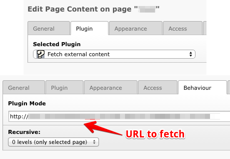

================================
TYPO3 CMS EXT:icti_fetch_content
================================

Fetch content from an external URL and insert as a regular content
element.

Usage
=====

After install a new plugin-type content will be available:

